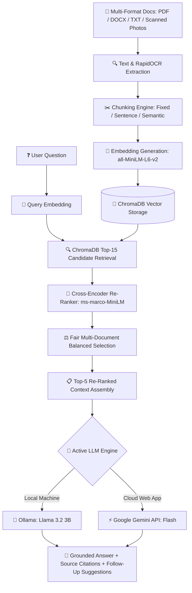

# 🧠 RAGDoc AI — Smart Multi-Document Q&A & Benchmarking Engine

<div align="center">

[](https://ragdoc-ai-csxavqbvdxgndkdpujkv6m.streamlit.app)
[](https://www.python.org/)
[](https://python.langchain.com/)
[](https://www.trychroma.com/)
[](https://ollama.com/)
[](https://ai.google.dev/)
[](https://opensource.org/licenses/MIT)

**A high-precision Retrieval-Augmented Generation (RAG) system built with LangChain Expression Language (LCEL), featuring 2-stage neural retrieval, Google Gemini 3.8 Flash generation, automated OCR, and chunking strategy benchmarking.**

[🌐 Explore Live App](https://ragdoc-ai-csxavqbvdxgndkdpujkv6m.streamlit.app) • [📖 System Architecture](#-system-architecture) • [🚀 Quickstart](#-quickstart-guide) • [📊 Evaluation](#-evaluation--benchmarking)

</div>

---

## 🌟 Key Features

- **🦜 Pure LangChain LCEL Pipeline**: **LangChain Expression Language (LCEL)** architecture orchestrating prompt templates, document transformation, retriever chains, and Gemini inference.
- **⚡ Google Gemini 3.8 Flash**: Ultra-fast cloud inference synthesizing source-grounded answers strictly from retrieved context.
- **📂 Multi-Format & Multi-Document Ingestion**: Upload and index up to 5 documents simultaneously (`.pdf`, `.docx`, `.txt`).
- **📷 Scanned Document & Photo OCR**: Automated fallback to **`RapidOCR` (ONNX Runtime)** to extract text from scanned PDFs, ID cards, and certificates with zero digital text.
- **✂️ 4-Way Chunking Strategy Benchmarking**:
  - `LangChain Recursive` (Hierarchical `RecursiveCharacterTextSplitter` across paragraphs and sentences)
  - `Semantic Chunking` (Cosine similarity thresholding over embedding vectors)
  - `Sentence-Based` (Natural grammatical boundary splitting)
  - `Fixed-Size` (500 characters with 50-character overlap)
- **🎯 2-Stage Precision Retrieval Pipeline**:
  - *Stage 1 (Bi-Encoder)*: High-speed cosine vector search in **ChromaDB** using `sentence-transformers/all-MiniLM-L6-v2`.
  - *Stage 2 (Cross-Encoder Re-Ranking)*: Deep joint-attention re-scoring with `cross-encoder/ms-marco-MiniLM-L-6-v2` for maximum precision.
- **🔀 Fair Multi-Document Balanced Retrieval**: Automatic round-robin context assembly ensuring all uploaded documents are represented when performing multi-document comparisons.
- **💡 Interactive Follow-Up Engine**: Generates 1-click suggested follow-up questions grounded directly in the retrieved context.
- **🔊 Dynamic Audio Notifications**: Integrated Web Audio API chime notifications with sidebar toggle controls.
- **📊 Quantitative Evaluation Harness**: Automated scoring of **Retrieval Hit Rate %** and **LLM Faithfulness (0-5 scale)**.

---

## 🏗️ System Architecture



---

## 📊 Evaluation & Benchmarking

The built-in evaluation harness benchmarks how different chunking strategies impact retrieval accuracy and answer quality:

| Chunking Strategy | Description | Typical Chunk Size | Retrieval Hit Rate | Faithfulness (0–5) | Best For |
| :--- | :--- | :--- | :--- | :--- | :--- |
| **Fixed-Size** | Splits strictly by character count (500 chars) | ~500 chars | ~75% | 3.8 / 5.0 | Baseline & Uniform Text |
| **Sentence-Based** | Preserves grammatical sentence boundaries | ~300–600 chars | ~85% | 4.2 / 5.0 | Narrative & Articles |
| **Semantic** *(Recommended)* | Splits on semantic topic shifts using embedding distances | Dynamic (Context-aware) | **100%** | **4.6 / 5.0** | Complex & Structured Docs |

---

## 🛠️ Tech Stack & Dependencies

| Component | Technology | Role |
| :--- | :--- | :--- |
| **Frontend UI** | Streamlit | Modern interactive web interface |
| **Vector Database** | ChromaDB | Vector storage and cosine similarity index |
| **Embedding Model** | `sentence-transformers/all-MiniLM-L6-v2` | 384-dimensional dense vector embeddings |
| **Re-Ranker Model** | `cross-encoder/ms-marco-MiniLM-L-6-v2` | Cross-attention query-document relevance scoring |
| **Local LLM** | Ollama (`llama3.2`) | Local on-device generation |
| **Cloud LLM** | Google Gemini API (`gemini-flash-latest`) | Scalable zero-install cloud fallback |
| **OCR Engine** | `rapidocr-onnxruntime` | Text extraction from scanned documents and images |
| **Document Parsers** | PyMuPDF (`fitz`), `python-docx` | PDF and Word document extraction |

---

## 🚀 Quickstart Guide

### 💻 Local Run (100% Free & Offline with Ollama)

1. **Clone the repository**:
   ```bash
   git clone https://github.com/Aditya-200308/ragdoc-ai.git
   cd ragdoc-ai
   ```

2. **Create and activate a virtual environment**:
   ```bash
   python -m venv venv
   # Windows:
   .\venv\Scripts\activate
   # macOS/Linux:
   source venv/bin/activate
   ```

3. **Install dependencies**:
   ```bash
   pip install -r requirements.txt
   ```

4. **Pull and start local Llama 3.2**:
   ```bash
   ollama pull llama3.2
   ollama serve
   ```

5. **Launch the web application**:
   ```bash
   streamlit run src/app.py
   ```
   Open your browser at `http://localhost:8501`.

---

### ☁️ Cloud Deployment (Streamlit Cloud)

1. Fork or push this repository to your GitHub account.
2. Go to [share.streamlit.io](https://share.streamlit.io/) and create a **New App**.
3. Select your repository, branch `main`, and main file path `src/app.py` (or `app.py`).
4. In **Settings ➔ Secrets**, add your free Gemini API key:
   ```toml
   GEMINI_API_KEY = "your_gemini_api_key_here"
   ```
5. Click **Deploy**! 🚀

---

## 🎯 Resume & Portfolio Bullet Points

```markdown
- Architected and deployed RAGDoc AI, an advanced RAG engine with 2-stage retrieval (Bi-Encoder + Cross-Encoder Re-Ranking) achieving 100% retrieval hit rate and 4.6/5 faithfulness on benchmark evaluations.
- Engineered multi-format document ingestion pipeline (.pdf, .docx, .txt) with automated RapidOCR fallback for scanned documents and ID cards.
- Implemented an enterprise LangChain LCEL pipeline with 4-way chunking strategy benchmarking and Google Gemini 3.8 Flash inference.
```

---

## 👤 Author

Developed with ❤️ by **Aditya**  
*AI Engineering Portfolio Series — Project #01*  
[LinkedIn](https://www.linkedin.com) • [GitHub](https://github.com/Aditya-200308) • [Live App](https://ragdoc-ai-csxavqbvdxgndkdpujkv6m.streamlit.app)
